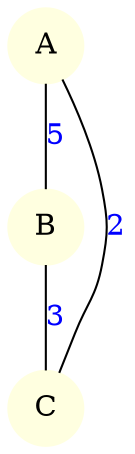

# Version Parallèle de Floyd-Warshall (MPI)

## 1. Description rapide

Ce dossier contient **ma version parallèle** de l’algorithme de Floyd-Warshall.

Le programme ne lit pas directement une matrice d’adjacence :
 il lit un **graphe pondéré au format Graphviz `.dot`**,
puis construit la matrice d’adjacence en mémoire avant de lancer Floyd-Warshall par blocs.

La grande matrice est découpée en **blocs**, et chaque processus s’occupe de certains blocs.
À chaque itération, le bloc pivot est diffusé aux autres processus pour mettre à jour les distances.

📌 **Référence consultée**
Asmita Gautam, *Parallel Floyd-Warshall Algorithm*, University at Buffalo, 2019.

---

## 2. Fichiers importants

* **`main_mpi.cpp`** – point d’entrée MPI :
  lit le fichier `.dot`, construit la matrice d’adjacence, appelle `ParallelFloydWarshallBlocks`.
* **`ForGraphMPI.cpp / .hpp`** – lecture du fichier DOT avec Graphviz (CGraph)
  → transforme le graphe en matrice d’adjacence (non orientée, pondérée).
* **`ParallelFWBlocks.cpp / .hpp`** – implémentation de Floyd-Warshall par blocs (version parallèle).
* **`Distribution.cpp / .hpp`** – répartition des blocs entre les processus MPI.
* **`Utils.cpp / .hpp`** – fonctions utilitaires (affichage, écriture dans un fichier texte).
* **`Makefile`** – script de compilation.

---

## 3. Compilation

Depuis le dossier :

```bash
cd FLOYD_PARALLEL_RABAH
make
```

Ça produit un exécutable :

```bash
./main_mpi
```

---

## 4. Format du fichier d’entrée (`.dot`)

Le programme attend un **fichier DOT Graphviz** décrivant un graphe pondéré non orienté, par exemple :



`ForGraphMPI.cpp` parcourt ce fichier, numérote les sommets (0, 1, 2, …) et construit une matrice d’adjacence `nb_nodes × nb_nodes` avec les poids, puis on applique Floyd-Warshall sur cette matrice.

Les fichiers `.dot` d’exemple sont dans le dossier :

```bash
../DATA
```

---

## 5. Exécution

Commande générale :

```bash
mpirun -np <nb_processus> ./main_mpi <chemin_fichier_dot>
```

Exemple :

```bash
mpirun -np 4 ./main_mpi ../DATA/PetitExemple.dot
```

Ou avec un autre graphe :

```bash
mpirun -np 4 ./main_mpi ../DATA/Resulat_sequence_by_premier_algo.dot
```

---

## 6. Sortie du programme

À la fin du calcul, le **rang 0** :

* récupère la matrice finale des plus courts chemins,
* l’écrit dans un fichier texte :

```bash
../DATA/matrice_finale_sortie_de_floyd_warshal.txt
```

Ce fichier sera ensuite utilisé comme entrée pour l’algorithme de PAM.

Le rang 0 affiche aussi le **temps d’exécution de la partie parallèle** (entre les deux `MPI_Barrier` dans `main_mpi.cpp`).

---


## 7. Nettoyage

Pour supprimer les fichiers objets et recompiler proprement :

```bash
make clean
```


## Parallélisation de l’algorithme de Floyd–Warshall

### Principe général

L’algorithme de Floyd–Warshall calcule les plus courts chemins entre tous les couples de sommets en appliquant la relation :

                        D[i][j] = min(D[i][j], D[i][k] + D[k][j])


Pour rendre ce calcul exploitable sur des graphes de taille plus importante, j’ai utilisé une version **par blocs** parallélisée avec **MPI**.
La matrice des distances est découpée en blocs (b \times b), et ces blocs sont répartis sur une **grille 2D de processus**. Chaque processus ne stocke et ne met à jour que les blocs dont il est responsable.

Cette approche reprend le schéma présenté dans le sujet (découpage en blocs, grille de processus, diffusion du pivot) et la structure décrite dans le document d’Asmita Gautam (*Parallel Floyd–Warshall Algorithm*, 2019).

### Distribution initiale

Au départ, la matrice d’adjacence est connue intégralement sur le rang 0.
Elle est ensuite distribuée bloc par bloc : pour chaque bloc ((i,j)), une fonction de répartition (`ownerOf`) indique sur quel processus il doit résider. Ce processus initialise son bloc à partir de la matrrice d’adjacence (poids de l’arête, 0 sur la diagonale, “pas de chemin direct” sinon).

Ainsi, chaque rang MPI dispose d’un sous-ensemble de blocs, pas forcément contigus, et la matrice globale est implicitement répartie sur toute la grille.

### Déroulement d’une itération parallèle

Pour chaque étape (k) (bloc diagonal ((k,k))) :

1. **Bloc pivot**
   Le processus qui possède le bloc ((k,k)) applique localement Floyd–Warshall **à l’intérieur de ce bloc** (`fw_block`).
   Le bloc pivot mis à jour est ensuite diffusé à tous les processus par `MPI_Bcast`.

2. **Mise à jour de la ligne (k)**
   Pour chaque bloc ((k, j)) sur la même ligne que le pivot :

   * le processus propriétaire met à jour ce bloc avec `fw_row`, en utilisant le pivot,
   * puis le bloc mis à jour est diffusé à tous via `MPI_Ibcast`.
     Chaque rang reçoit ces blocs mais n’utilise que ceux dont il a besoin pour ses blocs internes.

3. **Mise à jour de la colonne (k)**
   De manière symétrique, pour chaque bloc ((i, k)) sur la même colonne :

   * le propriétaire applique `fw_col`,
   * puis diffuse le résultat à tous les processus avec `MPI_Ibcast`.

4. **Mise à jour des blocs internes**
   Une fois les blocs de la ligne (k) et de la colonne (k) disponibles, chaque processus met à jour ses **blocs internes** ((i,j)) (ni sur la ligne (k), ni sur la colonne (k)) à l’aide de `fw_inner`, en combinant :

   * le bloc ((i,k)) reçu dans `colBlocks[i]`,
   * le bloc ((k,j)) reçu dans `rowBlocks[j]`.

L’usage de `MPI_Ibcast` permet de recouvrir une partie des communications avec les calculs locaux : pendant que certains blocs sont en train d’être diffusés, les processus peuvent déjà commencer à traiter d’autres blocs.

### Rassemblement du résultat

À la fin des itérations, chaque processus possède la version finale des blocs dont il est responsable.
Le rang 0 récupère ces blocs un par un (en utilisant `MPI_Send` / `MPI_Recv`) et reconstruit la matrice complète des distances (n * n).
Cette matrice est ensuite utilisée comme entrée de l’algorithme PAM pour la phase de clustering.


