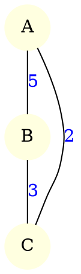

# Version Parallèle de Floyd-Warshall (MPI)

## 1. Description rapide

Ce dossier contient **ma version parallèle** de l’algorithme de Floyd-Warshall.

Le programme ne lit pas directement une matrice d’adjacence :
 il lit un **graphe pondéré au format Graphviz `.dot`**,
puis construit la matrice d’adjacence en mémoire avant de lancer Floyd-Warshall par blocs.

La grande matrice est découpée en **blocs**, et chaque processus s’occupe de certains blocs.
À chaque itération, le bloc pivot est diffusé aux autres processus pour mettre à jour les distances.

📌 **Référence consultée**
Asmita Gautam, *Parallel Floyd-Warshall Algorithm*, University at Buffalo, 2019.

---

## 2. Fichiers importants

* **`main_mpi.cpp`** – point d’entrée MPI :
  lit le fichier `.dot`, construit la matrice d’adjacence, appelle `ParallelFloydWarshallBlocks`.
* **`ForGraphMPI.cpp / .hpp`** – lecture du fichier DOT avec Graphviz (CGraph)
  → transforme le graphe en matrice d’adjacence (non orientée, pondérée).
* **`ParallelFWBlocks.cpp / .hpp`** – implémentation de Floyd-Warshall par blocs (version parallèle).
* **`Distribution.cpp / .hpp`** – répartition des blocs entre les processus MPI.
* **`Utils.cpp / .hpp`** – fonctions utilitaires (affichage, écriture dans un fichier texte).
* **`Makefile`** – script de compilation.

---

## 3. Compilation

Depuis le dossier :

```bash
cd Floyd_parallel_by_rabah_toubal/
make
```

Ça produit un exécutable :

```bash
./main_mpi
```

---

## 4. Format du fichier d’entrée (`.dot`)

Le programme attend un **fichier DOT Graphviz** décrivant un graphe pondéré non orienté, par exemple :



`ForGraphMPI.cpp` parcourt ce fichier, numérote les sommets (0, 1, 2, …) et construit une matrice d’adjacence `nb_nodes × nb_nodes` avec les poids, puis on applique Floyd-Warshall sur cette matrice.

Les fichiers `.dot` d’exemple sont dans le dossier :

```bash
../../DATA
```

---

## 5. Exécution

Commande générale :

```bash
mpirun -np <nb_processus> ./main_mpi <chemin_fichier_dot>
```

Exemple :

```bash
mpirun -np 4 ./main_mpi ../../DATA/PetitExemple.dot
```

Ou avec un autre graphe :

```bash
mpirun -np 4 ./main_mpi ../../DATA/Resulat_sequence_by_premier_algo.dot
```

---

## 6. Sortie du programme

À la fin du calcul, le **rang 0** :

* récupère la matrice finale des plus courts chemins,
* l’écrit dans un fichier texte :

```bash
../../DATA/matrice_finale_sortie_de_floyd_warshal.txt
```

Ce fichier sera ensuite utilisé comme entrée pour l’algorithme de PAM.

Le rang 0 affiche aussi le **temps d’exécution de la partie parallèle** (entre les deux `MPI_Barrier` dans `main_mpi.cpp`).

---


## 7. Nettoyage

Pour supprimer les fichiers objets et recompiler proprement :

```bash
make clean
```


